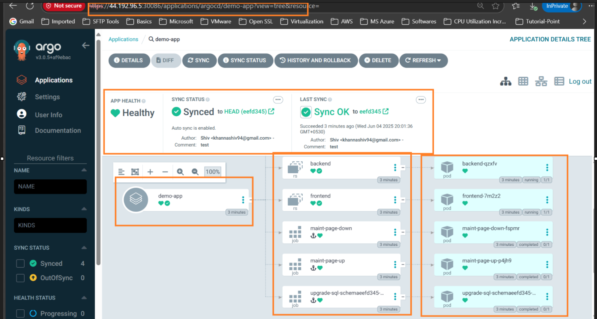

## Multi-Cluster deployment using GitOps ( Using ArgoCD where we are using hub cluster and spoke clusters )
- This repository demonstrates how to set up a multi-cluster deployment using GitOps principles with ArgoCD. The architecture consists of a hub cluster that manages multiple spoke clusters (in this case we have 2 spokes cluster).
- This approach allows for centralized management of applications across different Kubernetes clusters, enabling efficient deployment and scaling strategies.

### Table of Contents
- [Architecture Overview](#architecture-overview)
- [Prerequisites](#prerequisites)
- [Setup Instructions](#setup-instructions)
  - [Install ArgoCD on the Hub Cluster](#install-argocd-on-the-hub-cluster)
  - [Configure Spoke Clusters](#configure-spoke-clusters)
  - [Create Application Manifests](#create-application-manifests)
  - [Create ArgoCD Applications](#create-argocd-applications)
  - [Sync Applications](#sync-applications)

### Architecture Overview

## Custom Architecture Diagram

Below is a conceptual architecture diagram illustrating the hub-and-spoke model using ArgoCD and GitOps:

> **Note:** GitHub and some markdown viewers do not natively render Mermaid diagrams.  
> To view the architecture diagram, use a markdown editor or platform that supports Mermaid (such as VS Code with the Mermaid extension, or GitHub's web interface with the appropriate feature enabled).

<details>
<summary>Click to view Mermaid Architecture Diagram</summary>

```mermaid
flowchart TD
    subgraph Hub Cluster
        A[ArgoCD Server]
    end

    subgraph Spoke Cluster 1
        B[Kubernetes API<br>+ Applications]
    end

    subgraph Spoke Cluster 2
        C[Kubernetes API<br>+ Applications]
    end

    D[Git Repository<br>(App Manifests)]

    D -- "GitOps Sync" --> A
    A -- "App Deploy/Sync" --> B
    A -- "App Deploy/Sync" --> C

    style A fill:#f9f,stroke:#333,stroke-width:2px
    style B fill:#bbf,stroke:#333,stroke-width:2px
    style C fill:#bbf,stroke:#333,stroke-width:2px
    style D fill:#cfc,stroke:#333,stroke-width:2px
```

</details>

**Legend:**
- **Hub Cluster:** Runs ArgoCD, manages deployments.
- **Spoke Clusters:** Target clusters where applications are deployed.
- **Git Repository:** Source of truth for manifests.

This diagram shows how ArgoCD in the hub cluster pulls manifests from Git and deploys them to spoke clusters, following GitOps principles.


### Prerequisites
- Kubernetes clusters (1 hub cluster and multiple spoke clusters)
- ArgoCD installed on the hub cluster
- Access to the Git repository containing the application manifests
### Setup Instructions

1. **Install ArgoCD on the Hub Cluster**
   - Follow the [ArgoCD installation guide](https://argo-cd.readthedocs.io/en/stable/getting_started/) to set up ArgoCD on your hub cluster. 

2. **Configure Spoke Clusters**
    - Ensure that each spoke cluster is registered with the hub cluster. You can use the `argocd cluster add` command to add each spoke cluster to ArgoCD.
    - Example command:
      ```bash
      argocd cluster add <context-name>
      ```
3. **Create Application Manifests**
   - Create Kubernetes manifests for your applications in a Git repository. Ensure that the manifests are structured to be compatible with ArgoCD.
   - Example structure:
     ```
     ├── apps
     │   ├── app1
     │   │   └── kustomization.yaml
     │   └── app2
     │       └── kustomization.yaml
     └── clusters
         ├── spoke-cluster1
         │   └── app1.yaml
         └── spoke-cluster2
             └── app2.yaml
     ```    
4. **Create ArgoCD Applications**
   - Use the ArgoCD CLI or UI to create applications that point to the manifests in your Git repository.
   - Example command:
     ```bash
     argocd app create <app-name> \
       --repo <repo-url> \
       --path <path-to-manifests> \
       --dest-server <spoke-cluster-api-url> \
       --dest-namespace <namespace>
     ```
5. **Sync Applications**
    - After creating the applications, you can sync them to deploy the manifests to the respective spoke clusters.
    - Example command:
      ```bash
      argocd app sync <app-name>
      ```
### Monitoring and Management
- Use the ArgoCD UI to monitor the status of your applications across clusters.
- You can also use the ArgoCD CLI to check the status of applications and perform operations like sync, rollback, etc. 
- Example command to check application status:
  ```bash
  argocd app list
  ```

### Troubleshooting
- Ensure that the spoke clusters are reachable from the hub cluster.
- Check the ArgoCD logs for any errors related to application synchronization.

### Conclusion
This setup allows you to manage multiple Kubernetes clusters using GitOps principles with ArgoCD, providing a centralized way to deploy and manage applications across clusters. By following the steps outlined above, you can achieve a robust multi-cluster deployment strategy.

### For Practice please refer following git repositories
- [ArgoCD Hub-Spoke Demo Guide](https://github.com/iam-veeramalla/argocd-hub-spoke-demo/blob/main/03-argocd-install.md)
- [ArgoCD Command Parameters Configuration Example](https://github.com/argoproj/argo-cd/blob/54f1572d46d8d611018f4854cf2f24a24a3ac088/docs/operator-manual/argocd-cmd-params-cm.yaml#L82)
- [ArgoCD Example Applications](https://github.com/argoproj/argocd-example-apps)

### References
- [AWS CLI Installation Guide](https://docs.aws.amazon.com/cli/latest/userguide/getting-started-install.html)
- [Configure AWS CLI for EKS](https://docs.aws.amazon.com/eks/latest/userguide/install-awscli.html)
- [Install kubectl on Windows (AWS EKS Guide)](https://docs.aws.amazon.com/eks/latest/userguide/install-kubectl.html#windows_kubectl)
- [eksctl Installation Guide](https://eksctl.io/installation/)
- [GitOps with ArgoCD](https://argo-cd.readthedocs.io/en/stable/getting_started/)
- [ArgoCD CLI Installation Guide](https://argo-cd.readthedocs.io/en/stable/cli_installation/)
- [ArgoCD CLI Reference](https://argo-cd.readthedocs.io/en/stable/user-guide/commands/argocd/)

## Commands used are as follows:
### Cluster Creation Commands
```bash
eksctl create cluster --region us-east-1 --name spoke-cluster-2
eksctl create cluster --region us-east-1 --name spoke-cluster-1  
eksctl create cluster --region us-east-1 --name hub-cluster
```
### Kubernetes Context and ArgoCD Installation Commands
```bash
kubectl config current-context
kubectl config get-contexts
kubectl config use-context iam-root-account@hub-cluster.us-east-1.eksctl.io
kubectl create namespace argocd
kubectl apply -n argocd -f https://raw.githubusercontent.com/argoproj/argo-cd/stable/manifests/install.yaml
kubectl get pods -n argocd
kubectl get svc -n argocd
kubectl get cm -n argocd
kubectl describe cm argocd-cmd-params-cm -n argocd
kubectl edit cm argocd-cmd-params-cm -n argocd
kubectl edit cm argocd-cmd-params-cm -n argocd | grep insecure
kubectl edit svc argocd-server -n argocd
kubectl get secret -n argocd
kubectl edit secret argocd-initial-admin-secret -n argocd
echo -n "XXXXXXXX" | base64 -d
```
### ArgoCD Login and Cluster Registration Commands
```bash
argocd login
argocd login 44.192.96.5:30086 --username admin --password XXXXX
argocd cluster list
argocd cluster list --server 44.192.96.5:30086
argocd cluster add iam-root-account@spoke-cluster-1.us-east-1.eksctl.io --server 44.192.96.5:30086
argocd cluster add iam-root-account@spoke-cluster-2.us-east-1.eksctl.io --server 44.192.96.5:30086
argocd cluster list -o json
```
### Cluster Deletion Commands
```bash
eksctl delete cluster --region=us-east-1 --name=spoke-cluster-1
eksctl delete cluster --region=us-east-1 --name=spoke-cluster-2
eksctl delete cluster --region=us-east-1 --name=hub-cluster
```
--- 
## Outcomes of Hands-On

- 
- 
- 
- 
- 
- 
- 
- 
- 
- 
- 
- 
- 
- 
- 
- 
- 
- 
- 
- 
- 
- 
- 
- 
- 
- 
- 

--- 


