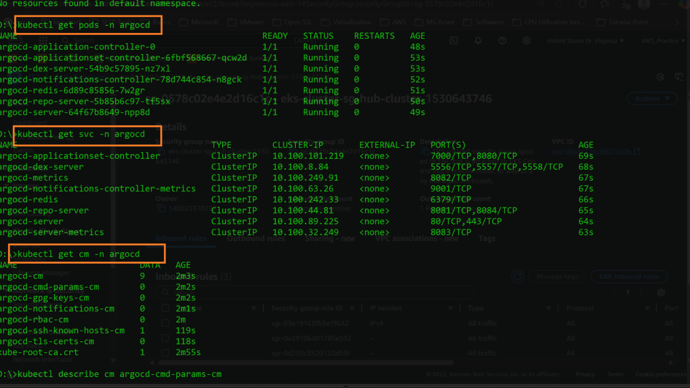
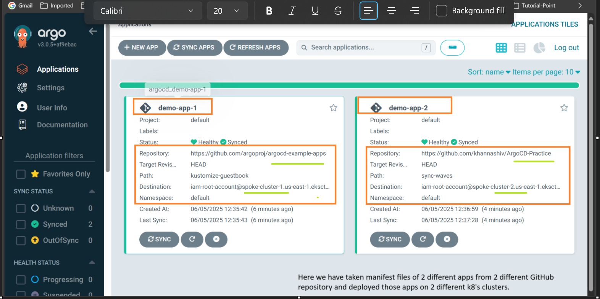

## Multi-Cluster deployment using GitOps ( Using ArgoCD where we are using hub cluster and spoke clusters )
- This repository demonstrates how to set up a multi-cluster deployment using GitOps principles with ArgoCD. The architecture consists of a hub cluster that manages multiple spoke clusters (in this case we have 2 spokes cluster).
- This approach allows for centralized management of applications across different Kubernetes clusters, enabling efficient deployment and scaling strategies.

### Table of Contents
- [Architecture Overview](#architecture-overview)
- [Prerequisites](#prerequisites)
- [Setup Instructions](#setup-instructions)
  - [Install ArgoCD on the Hub Cluster](#install-argocd-on-the-hub-cluster)
  - [Configure Spoke Clusters](#configure-spoke-clusters)
  - [Create Application Manifests](#create-application-manifests)
  - [Create ArgoCD Applications](#create-argocd-applications)
  - [Sync Applications](#sync-applications)

### Architecture Overview

### Prerequisites
- Kubernetes clusters (1 hub cluster and multiple spoke clusters)
- ArgoCD installed on the hub cluster
- Access to the Git repository containing the application manifests
### Setup Instructions

1. **Install ArgoCD on the Hub Cluster**
   - Follow the [ArgoCD installation guide](https://argo-cd.readthedocs.io/en/stable/getting_started/) to set up ArgoCD on your hub cluster. 

2. **Configure Spoke Clusters**
    - Ensure that each spoke cluster is registered with the hub cluster. You can use the `argocd cluster add` command to add each spoke cluster to ArgoCD.
    - Example command:
      ```bash
      argocd cluster add <context-name>
      ```
3. **Create Application Manifests**
   - Create Kubernetes manifests for your applications in a Git repository. Ensure that the manifests are structured to be compatible with ArgoCD.
   - Example structure:
     ```
     ├── apps
     │   ├── app1
     │   │   └── kustomization.yaml
     │   └── app2
     │       └── kustomization.yaml
     └── clusters
         ├── spoke-cluster1
         │   └── app1.yaml
         └── spoke-cluster2
             └── app2.yaml
     ```    
4. **Create ArgoCD Applications**
   - Use the ArgoCD CLI or UI to create applications that point to the manifests in your Git repository.
   - Example command:
     ```bash
     argocd app create <app-name> \
       --repo <repo-url> \
       --path <path-to-manifests> \
       --dest-server <spoke-cluster-api-url> \
       --dest-namespace <namespace>
     ```
5. **Sync Applications**
    - After creating the applications, you can sync them to deploy the manifests to the respective spoke clusters.
    - Example command:
      ```bash
      argocd app sync <app-name>
      ```
### Monitoring and Management
- Use the ArgoCD UI to monitor the status of your applications across clusters.
- You can also use the ArgoCD CLI to check the status of applications and perform operations like sync, rollback, etc. 
- Example command to check application status:
  ```bash
  argocd app list
  ```

### Troubleshooting
- Ensure that the spoke clusters are reachable from the hub cluster.
- Check the ArgoCD logs for any errors related to application synchronization.

### Conclusion
This setup allows you to manage multiple Kubernetes clusters using GitOps principles with ArgoCD, providing a centralized way to deploy and manage applications across clusters. By following the steps outlined above, you can achieve a robust multi-cluster deployment strategy.

### For Practice please refer following git repositories
- [ArgoCD Hub-Spoke Demo Guide](https://github.com/iam-veeramalla/argocd-hub-spoke-demo/blob/main/03-argocd-install.md)
- [ArgoCD Command Parameters Configuration Example](https://github.com/argoproj/argo-cd/blob/54f1572d46d8d611018f4854cf2f24a24a3ac088/docs/operator-manual/argocd-cmd-params-cm.yaml#L82)
- [ArgoCD Example Applications](https://github.com/argoproj/argocd-example-apps)

### References
- [AWS CLI Installation Guide](https://docs.aws.amazon.com/cli/latest/userguide/getting-started-install.html)
- [Configure AWS CLI for EKS](https://docs.aws.amazon.com/eks/latest/userguide/install-awscli.html)
- [Install kubectl on Windows (AWS EKS Guide)](https://docs.aws.amazon.com/eks/latest/userguide/install-kubectl.html#windows_kubectl)
- [eksctl Installation Guide](https://eksctl.io/installation/)
- [GitOps with ArgoCD](https://argo-cd.readthedocs.io/en/stable/getting_started/)
- [ArgoCD CLI Installation Guide](https://argo-cd.readthedocs.io/en/stable/cli_installation/)
- [ArgoCD CLI Reference](https://argo-cd.readthedocs.io/en/stable/user-guide/commands/argocd/)

--- 
## Outcomes of Hands-On

- 
- 
- 
- 
- 
- 
- 
- 
- 
- 
- 
- 
- 
- 
- 
- 
- 
- 
- 
- 
- 
- 
- 
- 
- 
- 
- 

--- 